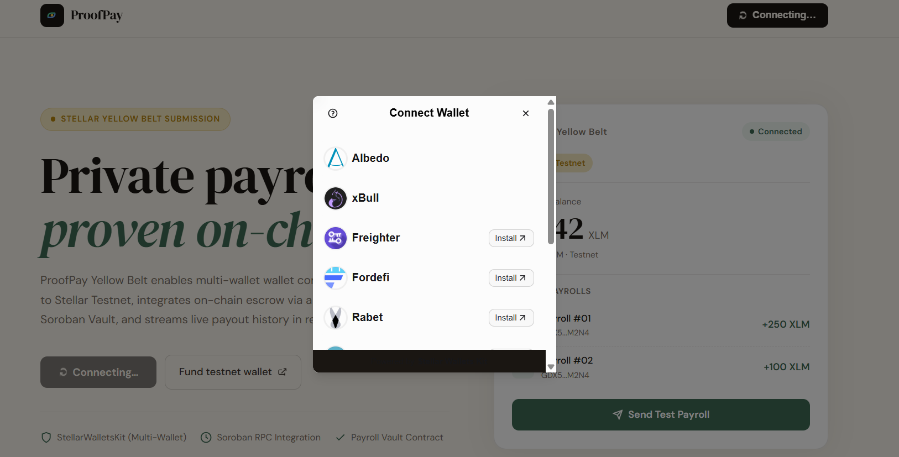
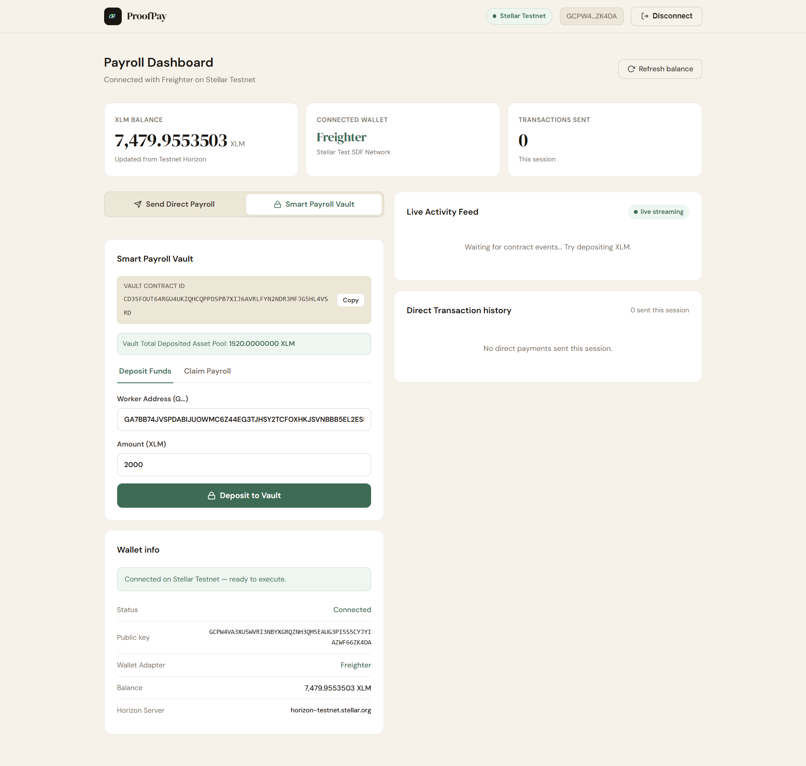

# ProofPay Level 2 — Yellow Belt Submission

## Overview

ProofPay Yellow Belt upgrades the White Belt foundation into a **multi-wallet Soroban payroll platform** on Stellar Testnet. This document is the official submission checklist and architecture reference for the Level 2 challenge.

---

## ✅ Yellow Belt Requirements Checklist

| Requirement | Status | Implementation |
|---|---|---|
| **StellarWalletsKit** | ✅ | `src/hooks/useStellarWallet.ts` — opens multi-wallet modal (Freighter, LOBSTR, xBull, etc.) |
| **3 error types** | ✅ | `WalletNotFound`, `UserRejected`, `InsufficientBalance` — distinct toast UI for each |
| **Soroban contract deployed** | ✅ | `contracts/payroll-vault/` — Deployed to testnet at `CD35FOUT64RGU4UKZQHCQPPDSPB7XIJ6AVRLFYN2NDR3MFJG5HL4VSRD` |
| **Contract called from frontend** | ✅ | `deposit()` and `claim()` via `invokeContract()` → wallet sign → `submitSorobanTx()` |
| **Transaction status visible** | ✅ | Pending spinner → Success receipt with hash → Error toast |
| **Real-time event streaming** | ✅ | `streamContractEvents()` polls `getEvents()` every 5s, renders Live Activity Feed |
| **2+ meaningful commits** | ⬜ | Will commit: contract + frontend integration |

---

## Architecture

```
ProofPay Yellow Belt
├── contracts/
│   └── payroll-vault/
│       ├── Cargo.toml                  — Soroban SDK 25.0.1
│       └── src/lib.rs                  — ProofPayVault contract (Rust)
│           ├── __constructor(admin, native_token)
│           ├── deposit(from, worker, amount) → PayrollDepositedEvent
│           ├── claim(worker) → PayrollClaimedEvent
│           ├── get_allocation(worker) → i128
│           └── get_total_deposited() → i128
│
├── src/
│   ├── hooks/
│   │   ├── useFreighter.ts              — Level 1 classic payment wallet (unchanged)
│   │   └── useStellarWallet.ts          — NEW: StellarWalletsKit multi-wallet + 3 error types
│   ├── lib/
│   │   ├── stellar.ts                   — Horizon + Soroban RPC helpers
│   │   │   ├── invokeContract()          — simulate + assemble tx
│   │   │   ├── submitSorobanTx()         — submit + poll for confirmation
│   │   │   ├── getContractAllocation()   — read persistent storage via getLedgerEntries
│   │   │   ├── getVaultTotalDeposited()  — simulate get_total_deposited
│   │   │   └── streamContractEvents()   — poll getEvents() every 5s
│   │   └── contractArgs.ts              — ScVal helpers (addressArg, xlmToStroopsArg, i128Arg)
│   ├── App.tsx                          — Dashboard with tab switcher, vault panel, activity feed
│   └── styles.css                       — Cream/ink/sage aesthetic + Level 2 vault/feed/toast CSS
```

---

## Smart Contract Details

**Contract:** `ProofPayVault`  
**Language:** Rust (Soroban SDK 25.0.1)  
**Network:** Stellar Testnet  
**Contract ID:** `CD35FOUT64RGU4UKZQHCQPPDSPB7XIJ6AVRLFYN2NDR3MFJG5HL4VSRD`  
*(Replace after running `stellar contract deploy ...`)*

### Functions

| Function | Auth | Description |
|---|---|---|
| `__constructor(admin, native_token)` | `admin` | Deploy-time init; stores admin + native XLM SAC address |
| `deposit(from, worker, amount)` | `from` | Employer deposits XLM for worker allocation |
| `claim(worker)` | `worker` | Worker claims their full allocation |
| `get_allocation(worker)` | None | Read worker's claimable balance (stroops) |
| `get_total_deposited()` | None | Read total vault balance (stroops) |

### Events

| Event | Topics | Description |
|---|---|---|
| `PayrollDepositedEvent` | `["payroll_deposited", from, worker, amount]` | Emitted on each deposit |
| `PayrollClaimedEvent` | `["payroll_claimed", worker, amount]` | Emitted on each claim |

### Storage

| Key | Type | Description |
|---|---|---|
| `Admin` | Instance | Contract administrator address |
| `NativeToken` | Instance | XLM SAC contract address |
| `TotalDeposited` | Instance | Sum of all current allocations (stroops) |
| `Allocation(Address)` | Persistent | Per-worker claimable balance (stroops) |

---

## Deployment Status

The smart contract is already built, tested, and deployed to Stellar Testnet:
- **Contract ID:** `CD35FOUT64RGU4UKZQHCQPPDSPB7XIJ6AVRLFYN2NDR3MFJG5HL4VSRD`
- **Wasm Hash:** `c7c7e94f2b2fc91a1f8b91d2e952af7172ca2fd8052a1e8ae0747415d5a88108`
- **Deployer Identity Address:** `GDRM7Y5MDHEVHV3YPVPGYXSQI5KCCAN4UBMNMJAUUDYIBHGDF6WMNZV3`

---

## Error Handling

Three wallet error types surface with distinct UI toast messages:

| Error Kind | Icon | Cause | UI Message |
|---|---|---|---|
| `WalletNotFound` | 🔌 | No wallet extension | "No Stellar wallet extension detected. Install Freighter or LOBSTR." |
| `UserRejected` | ❌ | User cancelled/denied | "You rejected the transaction in your wallet." |
| `InsufficientBalance` | 💸 | Simulation failed — low balance | "Your XLM balance is too low to cover this transaction + fees." |

---

## Transaction Receipts

Every successful contract call shows:
- Transaction hash (copyable)
- Ledger number
- StellarExpert Testnet link

---

## Live Activity Feed

Polls `Soroban RPC getEvents()` every 5 seconds for `payroll_deposited` and `payroll_claimed` events from the vault contract. Events render in reverse chronological order with:
- Event type icon (deposit ↓ / claim ↑)
- Amount in XLM
- Worker address (shortened)
- Ledger number
- StellarExpert link

---

## Screenshots

The complete on-chain lifecycle for the smart contract vault has been captured and documented below:

### 1. Multi-Wallet Connection Modal


### 2. Vault Deposit Panel & Live Activity Feed


### 3. Vault Deposit Transaction Successfully Submitted


### 4. Vault Deposit Transaction Explorer View


### 5. Vault Claim Payroll Panel


### 6. Vault Claim Transaction Successfully Submitted


### 7. Vault Claim Transaction Explorer View


---

## Submission Links

| Item | Value |
|---|---|
| **GitHub Repo** | https://github.com/KrishnaChoubey20/ProofPay |
| **Live Demo (Vercel)** | [https://proofpay-brown.vercel.app/](https://proofpay-brown.vercel.app/) |
| **Contract ID** | `CD35FOUT64RGU4UKZQHCQPPDSPB7XIJ6AVRLFYN2NDR3MFJG5HL4VSRD` |
| **Sample Deposit Tx** | [9b9039ca0b8beeaa77c48bd3cb0694cbb386dbcd67f294afe7b06c117f195b97](https://stellar.expert/explorer/testnet/tx/9b9039ca0b8beeaa77c48bd3cb0694cbb386dbcd67f294afe7b06c117f195b97) |
| **Sample Claim Tx** | [40c6f62842001d8c2029f0fa0e26045bf5395f673886c1ae9634d912040301b6](https://stellar.expert/explorer/testnet/tx/40c6f62842001d8c2029f0fa0e26045bf5395f673886c1ae9634d912040301b6) |
