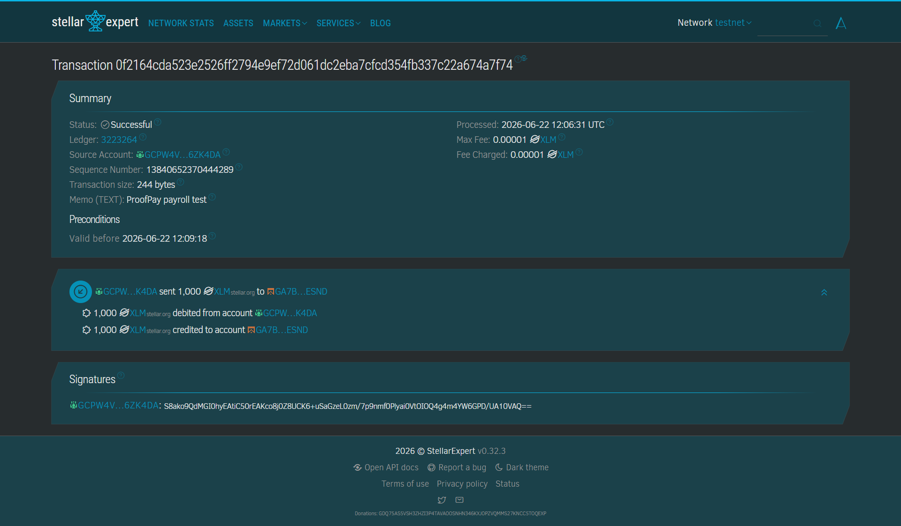

# ProofPay Alpha

ProofPay Alpha is a Stellar Testnet payroll prototype built for the Stellar Journey to Mastery White Belt challenge.

The full ProofPay vision is private payroll for global remote teams: workers receive payroll on Stellar and later generate selective income proofs for rent, loans, visas, and taxes without exposing their full wallet history. This Level 1 build focuses on the required fundamentals: wallet connection, balance display, and a signed XLM transaction on Stellar Testnet.

For the dedicated challenge submission notes, see [LEVEL1_WHITE_BELT_README.md](./LEVEL1_WHITE_BELT_README.md).

## White Belt Features

- Connect Freighter wallet
- Disconnect Freighter wallet
- Detect Stellar Testnet network
- Fetch the connected wallet's XLM balance from Horizon testnet
- Send a payroll-style XLM transaction on Stellar Testnet
- Show transaction loading, success, failure, hash, and explorer link
- Provide a ProofPay roadmap for the next belt levels

## Tech Stack

- React
- TypeScript
- Vite
- Freighter API
- Stellar JavaScript SDK
- Stellar Testnet Horizon

## Requirements

- Node.js 20 or newer
- Freighter browser wallet
- A funded Stellar Testnet account

Fund your testnet wallet with Friendbot:

```text
https://friendbot.stellar.org
```

## Run Locally

Install dependencies:

```bash
npm install
```

Start the app:

```bash
npm run dev
```

Build for production:

```bash
npm run build
```

## How To Test The Transaction Flow

1. Open the app in a browser with Freighter installed.
2. Set Freighter to Stellar Testnet.
3. Connect your wallet.
4. Confirm your XLM balance appears.
5. Paste a valid Stellar testnet recipient address.
6. Enter an XLM amount.
7. Click `Send Test Payroll`.
8. Sign the transaction in Freighter.
9. Confirm the success message and transaction hash appear in the app.

## Screenshots

### Wallet Connected & Balance Displayed


### Successful Transaction in App


### Transaction Confirmed on Explorer


## Repository

```bash
git remote add origin https://github.com/KrishnaChoubey20/ProofPay.git
git branch -M main
git push -u origin main
```

## Belt Roadmap

- White Belt: Freighter connection, XLM balance, testnet payroll transaction.
- Yellow Belt: employer and worker views, payroll history, multi-wallet flows.
- Orange Belt: smart contract payroll vault with scheduled payouts.
- Green Belt: USDC payroll, splitting rules, and selective income proof design.
- Blue Belt: 50-user pilot with freelancers and remote workers.
- Black Belt: mainnet launch, privacy proof layer, audits, and real employer onboarding.
