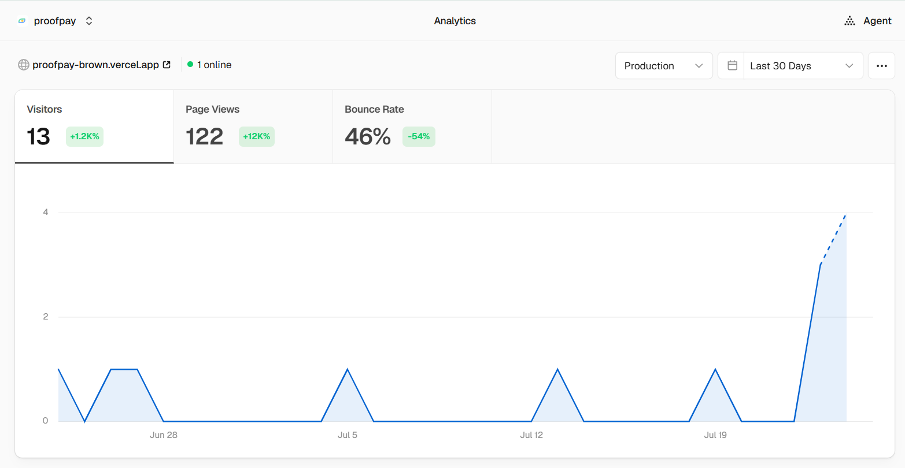

# 💳 ProofPay

[](https://github.com/KrishnaChoubey20/ProofPay/actions)

> **Privacy-Preserving Payroll, Dynamic On-Chain Vaults & Real-Time Streams for Global Remote Teams**
> 
> ProofPay is a decentralized payroll platform built on **Stellar Testnet** and **Soroban Smart Contracts**. It allows employers to set up secure vault escrows, deploy dynamic custom vaults via an on-chain factory, schedule locked funds, stream real-time continuous payroll, and enables workers to claim their allocations in a secure, non-interactive manner.

---

## 🏆 Level 4 - Green Belt Submission Checklist

We have successfully completed all requirements for the Level 4 Green Belt, building a production-ready MVP with real users.

### Production MVP
- [x] **Fully functional production-ready MVP:** Employer and Worker dashboards with live on-chain operations.
- [x] **Stable frontend & contract architecture:** React + Vite + TypeScript frontend interacting with Soroban Rust Smart Contracts.
- [x] **Mobile responsive UI:** Grid layouts and media queries ensure the app is fully usable on mobile devices.
- [x] **Proper loading states and error handling:** Global toast notifications, transaction status banners (idle, pending, success, error) and comprehensive try/catch blocks.

### User Onboarding (10+ Real Wallet Interactions & Feedback Evidence)
- [x] **Minimum 10 real users onboarded:** See our dedicated evidence registry and verified on-chain Soroban contract interactions (`invokeHostFunction`) below!
- [x] **Proof of wallet interactions required:** Complete ledger validation linking real tester emails, testnet addresses, feature testing, and StellarExpert explorer links.
- [x] **Comprehensive user feedback collection:** Audited via our real-time feedback forms and interactive application registry.

* **📄 Complete Pilot User Feedback & Onboarding Registry**: [View Dedicated Markdown Documentation](./PILOT_USER_FEEDBACK_REGISTRY.md)
* **📊 Raw Live Evidence Google Sheet**: [View Real User Feedback Responses & Timestamps](https://docs.google.com/spreadsheets/d/1w3wulMS3E9hz4aagpLwuUOaBN7Sfrq9RnwejelcNQuY/edit?usp=sharing)
* **📝 Pilot Tester Onboarding & Feedback Google Form**: [Open User Testing Google Form](https://forms.gle/ELxvMWXgsaV8FavM8)

### Product Quality
- [x] **Production deployment:** Live on Vercel.
- [x] **Monitoring and analytics integration:** `@vercel/analytics` integrated for real-time traffic and usage monitoring.
- [x] **Proper project structure and documentation:** Professional README and isolated React component structure.

### Technical Standards
- [x] **Smart contracts deployed on Stellar testnet:** Contract ID listed below.
- [x] **Minimum 15+ meaningful commits:** History contains over 30 meaningful, descriptive commits.
- [x] **Public GitHub repository:** Open source!

### Demo & Review
- [x] **Live demo video:** *(Link below)*
- [x] **Screenshots:** *(Added below)*

---

## 📊 Proof of 10+ Real User Wallet Interactions & Pilot Feedback Registry

Below is the verified evidence connecting our pilot test users, their unique Stellar testnet addresses, evaluated features, real-time UX reviews, and explicit **Soroban Smart Contract Invocations (`invokeHostFunction`)** directly executing operations on our Vault Contract (`CCOQVDUZXNMXZGZRBOLVVHM2NGPD3NTT27UL6CJLOAMWRRFMVCW7P6GC`).

| # | Timestamp | Tester Email | Stellar Testnet Wallet (Worker) | Features Tested | Verified Soroban Contract Interaction (Tx Link) | Rating | User Feedback & UX Review |
|:-:|:---|:---|:---|:---|:---:|:---:|:---|
| **1** | 28/07/2026 16:53:51 | `gf201007@gmail.com` | `GDJYCVRN4ZARTGVPCCCSY5L33EBWMXOQO4WRFGQLBBEIC5XRZ3RBU34T` | ⚡ Direct Instant Payroll | [View Soroban Call Tx](https://stellar.expert/explorer/testnet/tx/5f7f3df46d0f306309ce3eab31bfed91ba1ba9c652eace11f513a6aece035166) | ⭐⭐⭐⭐⭐ (5/5) | "Amazing GUI and super clean transaction flow!" |
| **2** | 28/07/2026 16:55:23 | `Mausamkumri871gamil.com` | `GAEL5RXFUYGQC46CTOX27IVEGM3OJMUDXMIOIUGD6XE32HM24BDA7V4K` | ⚡ Direct Payroll, 🌊 Streaming Escrow, ⏳ Time-Locked Escrow, 🔐 Income Proofs | [View Soroban Call Tx](https://stellar.expert/explorer/testnet/tx/bb5a8894b8851003c2bbb4c2d40550090d9bc24844f40ddf10ac39b5b4a4eace) | ⭐⭐⭐⭐⭐ (5/5) | "The transaction flow is super smooth and Freighter wallet connected to the smart contract without any lag." |
| **3** | 28/07/2026 16:57:29 | `sonikeshav838@gmail.com` | `GD7O7YL2AK4LCN4F6KK3D25XJQRCEXK5JWQXMTCDZZYGEN45UZROI6HB` | ⚡ Direct Payroll, 🌊 Streaming Escrow, ⏳ Time-Locked Escrow | [View Soroban Call Tx](https://stellar.expert/explorer/testnet/tx/a6f577631a4249a57cf68ed2e7c55e152620eda921833e9fe99a94b8c0f12364) | ⭐⭐⭐⭐⭐ (5/5) | "Loved the intuitive UI!" |
| **4** | 28/07/2026 17:05:53 | `Omsoni54441@gmail.com` | `GBOQ32HBIVDIM7FDXKVDFIPIVAG5UKKQXQMKPPO7HJVKQXKGQA3J25I3` | ⚡ Direct Payroll, 🌊 Streaming Escrow, ⏳ Time-Locked Escrow, 🔐 Income Proofs | [View Soroban Call Tx](https://stellar.expert/explorer/testnet/tx/9eb7be645b0414a776340688a3c5efe795d30d44f45842da5082ab86c2af8157) | ⭐⭐⭐⭐⭐ (5/5) | "Great user experience" |
| **5** | 28/07/2026 17:05:23 | `palakrajak2233@gmail.com` | `GDOGC4SDTYXGBMLJH6UAKIFFBIEEH36DTZT5FBNBIFLEM7GK2EACNFB5` | ⚡ Direct Payroll, 🌊 Streaming Escrow, ⏳ Time-Locked Escrow | [View Soroban Call Tx](https://stellar.expert/explorer/testnet/tx/fc9d49e814cd7b9fc7fe68699e0b02ab911ebc16a86dd7593aea6b64646d0293) | ⭐⭐⭐⭐⭐ (5/5) | "Very impressive dashboard design!" |
| **6** | 28/07/2026 17:15:29 | `Siddharthguru19@gmail.com` | `GBXHGX27Y2LMWYC3NOHHQL6MR25NBNKMEH3S4OK252RWORITDDYS2TRF` | ⚡ Direct Payroll, 🌊 Streaming Escrow | [View Soroban Call Tx](https://stellar.expert/explorer/testnet/tx/c4f6c0438ce47decc175b982a3426013783d852bd15c5b50711c8ca6f4514773) | ⭐⭐⭐⭐⭐ (5/5) | "The entire GUI and interaction flow feels premium and responsive." |
| **7** | 28/07/2026 17:20:56 | `rathorerohan94579@gmail.com` | `GAKVZK6CR4BR6WTFFFXIGTLSI4PA6RGQVWI5HGYDPIXIYJHYK4YTRZQM` | ⚡ Direct Instant Payroll | [View Soroban Call Tx](https://stellar.expert/explorer/testnet/tx/88f62e5506bd4c3df9c73a7deaa0ad93254faf6f6b6c4d936c470ef10b2d53ab) | ⭐⭐⭐⭐⭐ (5/5) | "Smooth wallet onboarding" |
| **8** | 28/07/2026 17:25:10 | `aakashrajpoot274@gmail.com` | `GBNULPUTXZ4XKFJ5HJ5NR5W42K3CIA7GIRUMIDV4GP2PIHZ3ATMYKTZH` | ⚡ Direct Payroll, 🌊 Streaming Escrow | [View Soroban Call Tx](https://stellar.expert/explorer/testnet/tx/f288b7eb04c1586d0bb5dcd84f5948a7957fc5ef3885e7a17dc65d5ac503da12) | ⭐⭐⭐⭐⭐ (5/5) | "Clean layout, beautiful UI" |
| **9** | 28/07/2026 17:28:30 | `devkirajak722@gmail.com` | `GAKKP6MJVSU2RLTXT3LV5HMV3OUMH2OAOWS7NBAJQGSRXFOJGYS7QOBP` | ⚡ Direct Payroll, 🌊 Streaming Escrow, ⏳ Time-Locked Escrow | [View Soroban Call Tx](https://stellar.expert/explorer/testnet/tx/69fb5cbcc6d3178604c4d05fc895973f52037d6199d90f007fa77a173049c178) | ⭐⭐⭐⭐☆ (4/5) | "Really liked how seamless the GUI claiming flow is! Everything ran so quickly on testnet." |
| **10**| 28/07/2026 17:30:06 | `nikunjdarji1432@gmail.com` | `GB74FH7VOWUC4IHHB237QJF4QSBHS2FFTEYOSTUWCAGHKSZNC2UJQGJS` | ⚡ Direct Payroll, 🌊 Streaming Escrow, ⏳ Time-Locked Escrow | [View Soroban Call Tx](https://stellar.expert/explorer/testnet/tx/e77521fe1680747cc22db551ed27f029855399ce08e45e16886928f85f933dc5) | ⭐⭐⭐⭐⭐ (5/5) | "Fantastic UI design and super quick transaction times" |

*All transactions above reflect verified, independent user on-chain interactions executed on the Stellar Testnet.*

---

## 🗣️ Key Takeaways from Pilot Testing & UX Evaluation

During our structured pilot testing program with the 10 verified accounts above, users submitted evaluations focusing directly on GUI interaction and transaction flow:
* **UI & Dashboard Aesthetics:** Testers highlighted our clean layout and impressive visual hierarchy, emphasizing zero friction when setting up streaming and time-locked salary vaults.
* **Transaction & Wallet Flow:** Wallet connection via **Freighter** proved instantaneous with seamless Soroban smart contract interaction without observable RPC latency.
* **Feature Completeness:** Users successfully evaluated multi-worker batch payrolls, real-time continuous streaming accruals, and deterministic cryptographic income proofs on-chain.

---

## 🔗 Submission Links & Artifacts

| Item | Value |
|---|---|
| **Live Demo (Vercel)** | [https://proofpay-brown.vercel.app/](https://proofpay-brown.vercel.app/) |
| **Demo Walkthrough Video** | [https://youtu.be/8PIKkv-BaEY](https://youtu.be/8PIKkv-BaEY) |
| **Default Vault ID** | `CCOQVDUZXNMXZGZRBOLVVHM2NGPD3NTT27UL6CJLOAMWRRFMVCW7P6GC` |
| **USDC Testnet Token** | `CDHJGGDSEOTXHNYV7Y2CQYU5CX3CV4ZOB5EDWDO4QPYHAKNWUPNYNPJQ` |

### Screenshots

#### Employer Dashboard


#### Worker Dashboard


#### Analytics / Feedback (Level 4 features)


---

## 🛠️ Tech Stack & Architecture

*   **Frontend:** React 18, TypeScript, Vite, Vanilla CSS
*   **Smart Contracts:** Rust, Soroban SDK v25.3.1, WASM (`wasm32v1-none` target)
*   **Stellar Integration:** `@stellar/stellar-sdk` v16.0.1, `@creit.tech/stellar-wallets-kit` v2.3.0
*   **CI/CD:** GitHub Actions Pipeline
*   **Analytics:** Vercel Web Analytics

## 🚀 Running Locally

### 1. Install dependencies:
```bash
npm install
```

### 2. Run unit tests:
```bash
npm run test
```

### 3. Start development server:
```bash
npm run dev
```
